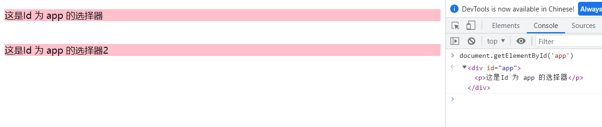
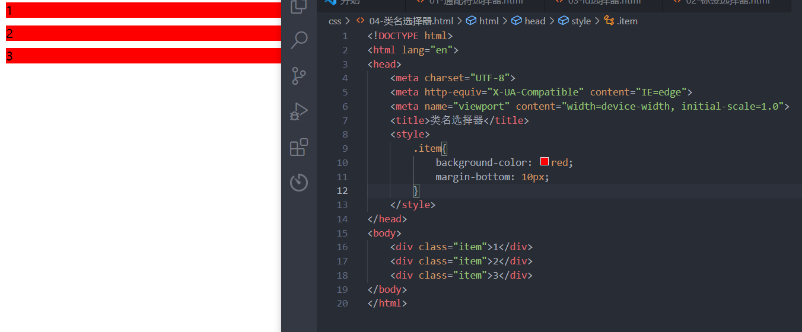
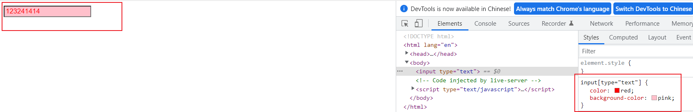
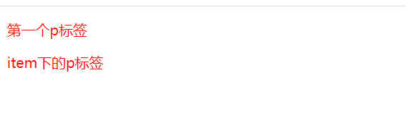
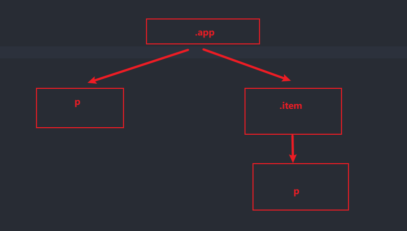
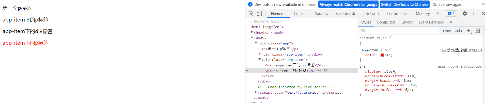
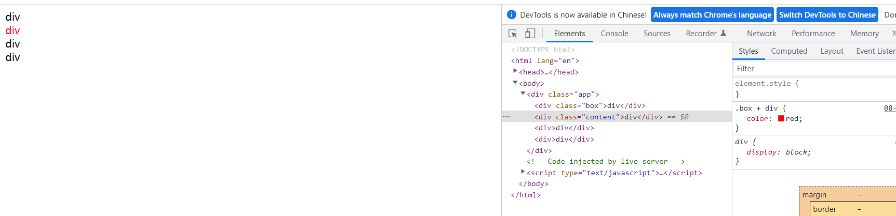
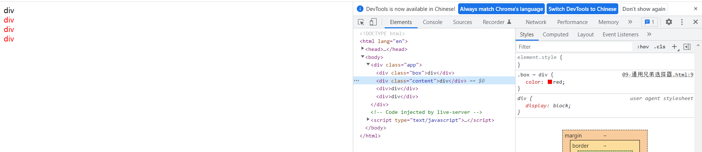
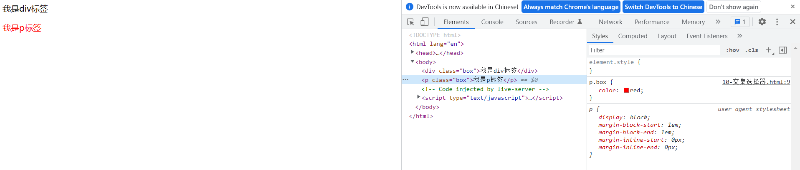
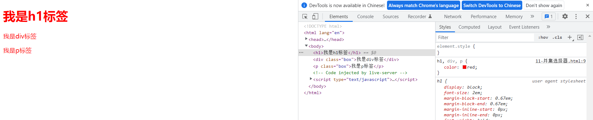

# css 选择器

# 1. 通配符选择器

用 * 号来选择页面里面的所有元素，通常会用来做初始化页面的一些默认样式

~~~css
*{
    margin: 0;
    padding: 0;
    box-sizing: border-box;
}
~~~

由于通配符选择要把样式覆盖到所有的元素上，因此它的效率不会高

# 2. 标签选择器

标签选择器就是选中 HTML 中的标签，直接使用 HTML中标签名来作为 css 的名称

~~~html
<!DOCTYPE html>
<html lang="en">
<head>
    <title>标签选择器</title>
    
</head>

<body>
    
我是div标签

    
我是p标签

</body>
</html>
~~~

**使用场景：标签选择器一般是用来重置 HTML 标签中的默认样式**

# 3. ID选择器

ID 选择器一般使用符号 “#” 加 ID 名称 来表示，用来选中 HTML 标签 id=“xx” 的 DOM 元素

~~~HTML
<!DOCTYPE html>
<html lang="en">
<head>
    <title>ID选择器</title>
    
</head>
<body>
    

        
这是Id 为 app 的选择器

    

    

        
这是Id 为 app 的选择器2

    

    
</body>
</html>
~~~

**注意：ID选择器 在开发中应该遵循着只有一个，虽然写重复并不会报错，但是在使用 js 来查找 ID选择器的 DOM 元素时候，依旧只会找到当前的第一个**

# 4. 类名选择器

类名选择器是通过 符号 . 加 类 名称 来表示，用来选中 HTML 标签 class=“xx” 的 DOM 元素

~~~html
<!DOCTYPE html>
<html lang="en">
<head>
    <title>类名选择器</title>
    
</head>
<body>
    
1

    
2

    
3

</body>
</html>
~~~

**使用场景：类名选择器一般是用来需要重复样式的**

# 5. 属性选择器

属性选择器是 HTML 标签里属性来选择，一般用括号 "[]" 包裹

~~~html
<!DOCTYPE html>
<html lang="en">
<head>
    <title>属性选择器</title>
    
</head>
<body>
    <input type="text" />
</body>
</html>
~~~

# 组合选择器

## 1. 后代选择器

从祖先标签开始找后代，会一直查找到后代，只要符合情况则样式会生效，选择器以 `空格` 来分隔

~~~html
<!DOCTYPE html>
<html lang="en">
<head>
    <meta charset="UTF-8">
    <meta http-equiv="X-UA-Compatible" content="IE=edge">
    <meta name="viewport" content="width=device-width, initial-scale=1.0">
    <title>后代选择器</title>
    
</head>
<body>
    

        
第一个p标签

        

            
item下的p标签

        

    

</body>
</html>
~~~

## 2. 子代选择器

子代选择器，只会查找子代，不会去查后代，选择器以 `>` 来分隔

~~~html
<!DOCTYPE html>
<html lang="en">
<head>
    <meta charset="UTF-8">
    <meta http-equiv="X-UA-Compatible" content="IE=edge">
    <meta name="viewport" content="width=device-width, initial-scale=1.0">
    <title>子代选择器</title>
    
</head>
<body>
    

        
第一个p标签

        

            

                
app-item下的p标签

            
           
        

        

            
app-item下的div标签

            
app-item下的p标签

        

    

</body>
</html>
~~~

## 3. 相邻兄弟选择器

相邻兄弟选择器只会查找最近的兄弟，选择器用 `+`  来分隔

~~~html
<!DOCTYPE html>
<html lang="en">
<head>
    <meta charset="UTF-8">
    <meta http-equiv="X-UA-Compatible" content="IE=edge">
    <meta name="viewport" content="width=device-width, initial-scale=1.0">
    <title>Document</title>
    
</head>
<body>
    

        
div

        
div

        
div

        
div

    

</body>
</html>
~~~

## 4. 通用兄弟选择器

会查找除自己外的，所有兄弟元素，用 `~` 来分隔

~~~html
<!DOCTYPE html>
<html lang="en">
<head>
    <meta charset="UTF-8">
    <meta http-equiv="X-UA-Compatible" content="IE=edge">
    <meta name="viewport" content="width=device-width, initial-scale=1.0">
    <title>Document</title>
    
</head>
<body>
    

        
div

        
div

        
div

        
div

    

</body>
</html>
~~~

## 5. 交集选择器

交集选择器是为了找两个或多个选择器的交集,用法就是把两个选择器放在一起

~~~html
<!DOCTYPE html>
<html lang="en">
<head>
    <meta charset="UTF-8">
    <meta http-equiv="X-UA-Compatible" content="IE=edge">
    <meta name="viewport" content="width=device-width, initial-scale=1.0">
    <title>Document</title>
    
</head>
<body>
    
我是div标签

    
我是p标签

</body>
</html>
~~~

## 6. 并集选择器

并集选择器是为了合并类型的样式,可以是选择器不用单样式相同的CSS语法块合并。并集选择器就是用多个逗号分隔多个选择器

~~~html
<!DOCTYPE html>
<html lang="en">
<head>
    <meta charset="UTF-8">
    <meta http-equiv="X-UA-Compatible" content="IE=edge">
    <meta name="viewport" content="width=device-width, initial-scale=1.0">
    <title>Document</title>
    
</head>
<body>
    <h1>我是h1标签</h1>
    
我是div标签

    
我是p标签

    
</body>
</html>
~~~

# 伪类选择器

