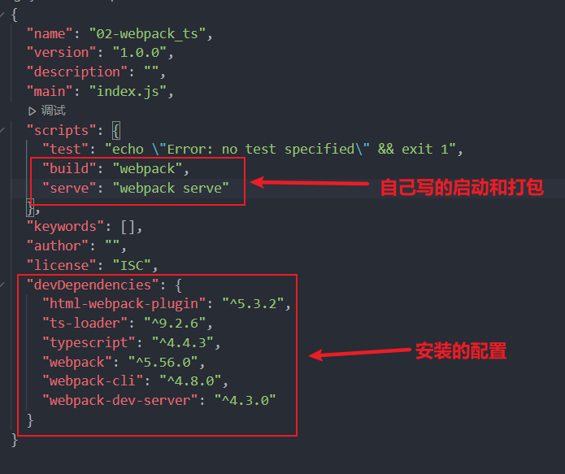
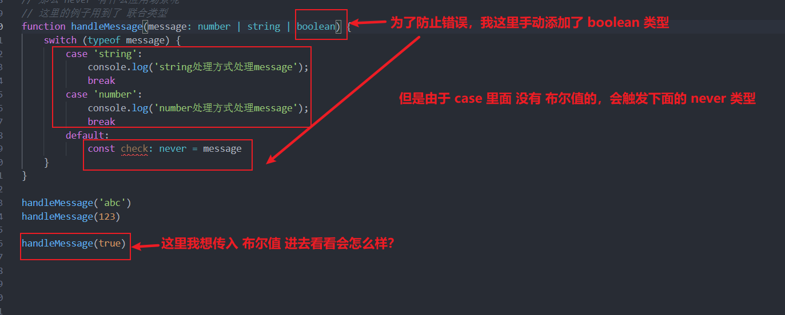
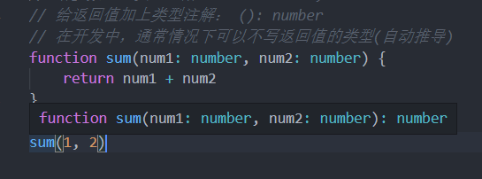
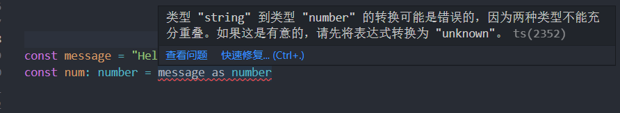
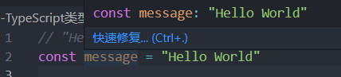
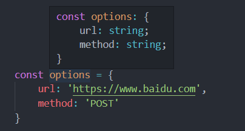
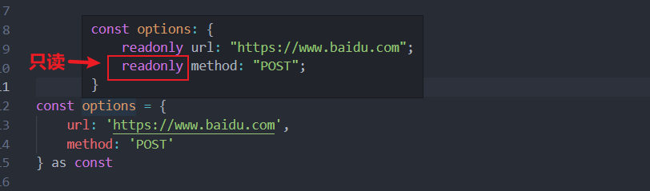
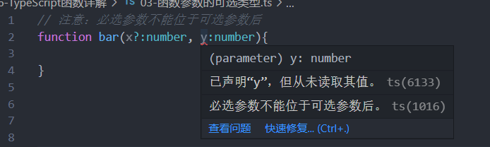

# TypeScript

## 有什么用

1. 解决 **类型错误**  问题，没有  **类型约束**， 同时可以培养 前端程序员 具备 **类型思维**

## 是什么

TypeScript 是拥有类型的 **JavaScript 超集** ，它可以编译成 **普通**、 **干净**、 **完整** 的 JavaScript 代码

简而言之：**加强版的 JavaScript**

- JavaScript所拥有的特性，TypeScript 全部支持，并且紧随 ECMAScript 的标准，所以 ES6、ES7、ES8等新语法标准，它都是支持的

- 在语言层面上，增加了 类型约束，而且包括一些语法的扩展，比如 枚举类型 (Enum)、元组类型 (Tuple) 等

- TypeScript 在实现新特性的同时，总是保持和 ES标准 的同步甚至是领先

- 并且 TypeScript 最终会被编译成 JavaScript 代码，所以你并不需要担心它的兼容性问题，在编译时也不需要借助 Babel 这样的工具

- 所以，可以把 TypeScript 理解成更加强大的 JavaScript，不仅让 JavaScript 更加安全，而且给它带来更多好用的特性

**TypeScript是一个强大的工具，用于构建大型项目**

1. 类型允许JavaScript开发者在开发JavaScript应用程序时使用高效的开发工具和常用操作比如静态检查和代码重构；

2. 类型是可选的，类型推断让一些类型的注释使你的代码的静态验证有很大的不同。类型让你定义软件组件之间的接口和洞察现有 JavaScript库的行为；

## 大前端的发展趋势

- 客户端开发者：从Android到iOS，或者从iOS到Android，到RN，甚至现在越来越多的客户端开发者接触前端
相关知识（Vue、React、Angular、小程序）；

- 前端开发者：从jQuery到AngularJS，到三大框架并行：Vue、React、Angular，还有小程序，甚至现在也要
接触客户端开发（比如RN、Flutter）；

- 目前又面临着不仅仅学习ES的特性，还要学习TypeScript；

- 新框架的出现，我们又需要学习新框架的特性，比如vue3.x、react18等等；

- 从开发者长远的角度来看，学习TypeScript有助于我们前端程序员培养 类型思维，这种思维方式对于完成大
型项目尤为重要。

## TypeScript 的编译环境

TypeScript最终会被编译成JavaScript来运行，所以我们需要搭建对应的环境：

在电脑上安装 TypeScript，这样就可以通过 TypeScript 的 Compiler 将其编译成 JavaScript；

全局安装 TypeScript
~~~
# 安装命令
npm install -g typescript

# 查看版本
tsc --version
~~~

## TypeScript 的运行环境

- 如果我们每次为了查看TypeScript代码的运行效果，都通过经过两个步骤的话就太繁琐了：
    - 第一步：通过tsc编译TypeScript到JavaScript代码；
    - 第二步：在浏览器或者Node环境下运行JavaScript代码；
    
- 是否可以简化这样的步骤呢？
    - 比如编写了TypeScript之后可以直接运行在浏览器上？
    - 比如编写了TypeScript之后，直接通过node的命令来执行？

- 上面我提到的两种方式，可以通过两个解决方案来完成：
    - 方式一：通过webpack，配置本地的TypeScript编译环境和开启一个本地服务，可以直接运行在浏览器上；
    - 方式二：通过ts-node库，为TypeScript的运行提供执行环境；

## 使用 ts-node(推荐)

安装 ts-node

~~~
npm install ts-node -g
~~~

另外 ts-node 需要依赖 tslib 和 @types/node 两个包

~~~
npm install tslib @types/node -g
~~~

使用 ts-node 运行 ts 文件的命令

~~~
ts-node math.ts
~~~

## webpack配置本地运行环境

需要提前初始化

~~~
npm init -y
~~~

安装 webpack 到本地

~~~
npm install webpack webpack-cli -D
~~~

安装 `ts-loader`  `typescript`

~~~
npm install ts-loader typescript -D
~~~

自动生成 `tsconfig.json` 文件

~~~
tsc --init
~~~

安装 `webpack-dev-server`

~~~
npm install webpack-dev-server -D
~~~

安装 `html-webpack-plugin` 插件

~~~
# 用于编译 wepack 项目中的 html 类型的文件
npm install html-webpack-plugin -D
~~~

创建 `webpack.config.js` 文件： 做如下配置

~~~js
const path = require('path')
const HtmlWebpackPlugin = require('html-webpack-plugin')

module.exports = {
    mode: "development",
    // 入口
    entry: "./src/main.ts",
    // 出口
    output: {
        path: path.resolve(__dirname, "./dist"),
        filename: "bundle.js"
    },
    devServer: {
    },
    resolve: {
        // 找文件会自动在后缀名上添加 .ts
        extensions: [".ts", ".js", ".cjs", ".json"]
    },
    module: {
        // 规则
        rules: [
            {
                test: /\.ts$/,
                loader: 'ts-loader'
            }
        ]
    },
    plugins: [
        new HtmlWebpackPlugin({
            template: "./index.html"
        })
    ]
}
~~~

## tslint

ts 代码规范

全局安装 tslint

~~~
npm install tslint -g
~~~

也可以在自己当前的根目录下生成 `tslint.json`

~~~
tslint --init
~~~

# 变量的定义

在 TypeScript 中定义变量需要指定 **标识符** 的类型

完整的声明格式如下：

~~~
var/let/const 标识符: 数据类型 = 赋值;
~~~

声明了 类型后的 TypeScript 就会进行 **类型检测** ，声明的类型可以称之为 **类型注解**

在TypeScript定义变量（标识符）和ES6之后一致，可以使用var、let、const来定义

~~~ts
var name: string = 'why'
let age: number = 18
const height: number = 1.88
~~~

## ts 里的数据类型 大小区分

- string: TypeScript 中的字符串类型
- String: JavaScript 的字符串包装类的类型

# 变量的类型推导

在开发中，有时候为了方便起见我们并不会在声明每一个变量时都写上对应的数据类型，我们更希望可以通过TypeScript本身的特性帮助我们推断出对应的变量类型

- 默认情况下进行赋值时，会将 赋值 的 值的类型，作为前面标识符的类型
~~~ts
let foo = "foo"
// foo = 123

// foo 没有添加类型注解
~~~
这个过程称之为 **类型推导/推断**

# TypeScript 的类型

**js 常见的类型**
- number 数字类型
- string 字符串类型
- boolean 布尔类型
- Array 数组类型
- Object 对象类型
- null 类型 
- undefined 类型

**es6 的类型(不常用)**
- Symbol 类型 

**ts 的独有的类型**
- any 类型
- unknown 类型
- void 类型
- never 类型
- tuple 元组类型 

## number 类型

数字类型，在 TypeScript 中和 JavaScript 一样，不区分整数类型 (int) 和 浮点型 (double)，统一为 **number** 类型

~~~ts
// 数字类型，在 TypeScript 中和 JavaScript 一样，不区分整数类型 (int) 和 浮点型 (double)，统一为 number 类型
let num: number = 123

// S6新增了二进制和八进制的表示方法，而TypeScript也是支持二进制、八进制、十六进制的表示

let num1: number = 100;     // 十进制
let num2: number = 0b110;   // 二进制
let num3: number = 0o555;   // 八进制
let num4: number = 0xf23;   // 十六进制
console.log(num1, num2, num3, num4);    // 100 6 365 3875
~~~

## string 类型

string类型是字符串类型，可以使用单引号或者双引号表示
~~~ts
// string类型是字符串类型，可以使用单引号或者双引号表示
let message: string = 'hello'

~~~

同时也支持模板字符串 来拼接 变量 和 字符串
~~~ts
const name = 'why';
const age = 18;
const height = 1.70

// 同时也支持 模板字符串 来拼接 变量 和 字符串
const info = `my name is ${name}, age is ${age}, height is ${height}`
console.log(info);  // my name is why, age is 18, height is 1.7
~~~

## boolean 类型

boolean类型只有两个取值：true 和 false
~~~ts
// boolean 类型的表示
let flag:boolean = true

flag = 20 > 30  // 因为 20 < 30，所以结果应为 false
console.log(flag);  // flase
~~~

## array 数组类型

数组类型 一般需要提前定义后里面存放数据的类型
~~~ts
// 数组类型的定义

// 首先需要确定一个事实：names 是一个数组类型，但是数组中存放的是什么类型的元素呢？
// 在数组中存放不同的类型是不好的习惯：一个数组中在 TypeScript 开发中，最好存到数据类型是固定的 （比如string）
// 类型注解

// 方法一：不推荐(react jsx中是有冲突)
const names1: Array<string> = []

// 方法二：推荐
const names: string[] = [] 
~~~

## object 对象类型

object对象类型可以用于描述一个对象
~~~ts
// const info: object = {
//     name: 'why',
//     age: 18
// }

const info = {
    name: 'why',
    age: 18
}

// 上面一旦添加了 object 类型注解后，这里就会报错
// console.log(info.name);
console.log(info.name);
~~~

## null 类型 和 undefined 类型
在TypeScript中，它们各自的类型也是undefined和null，也就意味着它们既是实际的值，也是自己的类型：

~~~ts
let n1: null = null
let n2: undefined = undefined

// 假如你想将值设为 null 类型，那么这里不推荐这么写，因为类型推断为 any 类型
let n3 = null
~~~

## symbol 类型(es6)
在es5中，我们是不可能在对象中添加相同的属性名称的
~~~ts
const person = {
    title: '程序员',
    title: '老师'
}
~~~

通常我们的做法的是定义两个不同的属性名字：比如 title1 和 title2
如果是在 es6 中，我们可以通过 symbol 来定义相同的名称，因为 symbol 函数返回的是不同的值
~~~ts
// 注意：这里不需要 new 一个 Symbol 对象，直接使用即可
const t1 = Symbol("title")
const t2 = Symbol("title")

const person = {
    [t1]: '程序员',
    [t2]: '老师'
}

console.log(person);    // { [Symbol(title)]: '程序员', [Symbol(title)]: '老师' }
~~~

## any 类型
在某些情况下，我们无法确定一个变量的类型，并且它可能会发生一些变化，这时候可以使用 any 类型

any 类型有点像是一种讨巧的 TypeScript 手段

- 我们可以对 any 类型的变量进行任何操作，包括获取不存在的属性、方法
- 我们给一个any 类型的变量赋值任何的值，比如数字、字符串的值

~~~ts
// any 类型的使用
// 当进行一些类型断言 as any
// 在不想给某些 JavaScript 添加具体的数据类型时(原生的 JavaScript代码是一样的)
let a: any = 'why';
a = 123;
a = true;
a = {};

console.log(a); // {}

// 这里在数组里存放任意数据(不推荐)
const arr: any[] = []

// 数组中应该存放确定的数据
~~~

## unknown 类型
unknown 是 TypeScript 中比较特殊的一种类型，它用于描述类型不确定的变量

unknown 和 any 的区别
- unknown 类型只能赋值给 any 和 unknown 类型
- any 类型可以赋值给任意类型

~~~ts
function foo():string {
    return 'foo'
}

function bar():string {
    return 'bar'
}

let flag = true

// 这里由于判断的结果不同，数据类型也会发生变化
let result: unknown

if(flag){
    result = foo()
}else{
    result = bar()
}

// unknown 可以防止 别人拿到这个值去滥用
// let message:string = result
// let num:number = result

console.log(result);    // foo
~~~

## void 类型
void 通常是用来指定一个函数是摸鱼返回值的，那么它的返回值就是 void 类型

我们可以 将 null 和 undefined 赋值给 void 类型，也就是函数可以返回 null 或者 undefined

~~~ts
function foo(num1:number, num2:number) {
    console.log(num1 + num2);
    return null
}

foo(10, 20) // 30
// foo('a', 'b')    // 报错
~~~

这个函数我们没有写任何类型，那么它默认返回值的类型就是void的，我们也可以显示的来指定返回值是void
void 默认可以不写

~~~ts
function foo(num1:number, num2:number): void{
    console.log(num1 + num2);
}
~~~

## never 类型
never 表示永远不会发生值的类型，比如一个函数

- 如果一个函数中是一个死循环或者抛出一个异常，那么这个函数不会返回东西
- 在这种情况下，写 void 类型 或者 其他类型作为返回值类型都不合适，我们可以使用 never 类型

~~~ts
function fn1(): never {
    // 死循环
    while (true) {
        // console.log(1);
    }
}

function fn2(): never {
    // 抛出错误
    throw new Error()
}
~~~

- never有什么样的应用场景呢？这里我们举一个例子，但是它用到了联合类型
~~~ts
function handleMessage(message: number | string) {
    switch (typeof message) {
        case 'string':
            console.log('string处理方式处理message');
            break
        case 'number':
            console.log('number处理方式处理message');
            break
        default: 
            const check: never = message
    }
}

handleMessage('abc')    // string处理方式处理message
handleMessage(123)      // number处理方式处理message
~~~

## tuple 类型
tuple是元组类型
~~~ts
// 假设我想在数组中传入不同的数据类型
// const  info: any[] = ['why', 18, 1.88]

// const name = info[0]
// console.log(name.length);
// 这里有弊端就是无法确定数组中到底是那个数据类型

// 这种情况我们可以使用元组
const  info: [string, number, number] = ['why', 18, 1.88]
const name = info[0]
console.log(name.length);

// const age = info[1]
// console.log(age.length); // 这里由于数据类型已经确定，所以会报错，因为数字类型没有 length
~~~
tuple 和 数组有什么区别？
- 首先，数组中通常建议存放相同类型的元素，不同类型的元素是不推荐放到数组中(可以放在对象或者元组中)
- 其次，元组中每个元素都有自己特性的类型，根据索引值获取到的值可以确定对应的类型

**元组的应用场景**
~~~ts
// 封装
function useState(state: any){
    // 创建局部变量保存传入的值
    let currentState = state
    
    // 一个函数可以传入一个新的值，新的值会覆盖掉原来的值
    const changeState = (newState: any) => {
        currentState = newState
    }

    // currentState 是 any 类型
    // changeState 是 数组 类型
    // 这里 用一个元组 来保存 一个旧值， 一个新值
    const tuple: [any, (newState: any) => void] = [currentState, changeState]

    // 返回元组
    return tuple
}

// 结构
const [counter, setCounter] = useState(10)
setCounter(1000)

const [title, setTitle] = useState('abc')
~~~

**优化**
~~~ts
// 这里用到了 泛型
function useState<T>(state: T){
    let currentState = state

    const changeState = (newState: T) => {
        currentState = newState
    }
    
    // const info: [string, number] = ['abc', 18]
    const tuple: [T, (newState: T) => void] = [currentState, changeState]

    return tuple
}

// 这里泛型默认会把传入的数据类型  传给 T
const [counter, setCounter] = useState(10);
setCounter(1000)
const [title, setTitle] = useState("abc")
const [flag, setFlag] = useState(true)
~~~

# TypeScript 类型补充
## 函数的参数类型

函数是JavaScript非常重要的组成部分，TypeScript允许我们指定函数的参数和返回值的类型

- 参数的类型注解
声明函数时，可以在每个参数后添加类型注解，以声明函数接受的参数类型

~~~ts
// 给参数加上类型注解：num1: number, num2: number
function sum(num1: number, num2: number) {
    return num1 + num2
}

sum(1, 2)
~~~

## 函数的返回值类型
添加返回值的类型注解，这个注解出现在函数列表的后面
~~~ts
// 给返回值加上类型注解： (): number
// 在开发中，通常情况下可以不写返回值的类型(自动推导)
function sum(num1: number, num2: number): number {
    return num1 + num2
}

sum(1, 2)
~~~

和变量的类型注解一样，我们通常情况下不需要返回类型注解，因为TypeScript会根据 return 返回值推断函数的返回类型

某些第三方库处于方便理解，会明确指定返回类型，但是这个看个人喜好

## 匿名函数的参数类型
匿名函数与函数声明会有一些不同

- 当一个函数出现在 TypeScript 可以确定该函数会被如何调用的地方时
- 该函数的参数会自动指定类型

~~~ts
const names = ['abc', 'zxc', 'qwe']

// item 根据上下文的环境推导出来的，这个时候可以不添加类型注解
// 上下文中的函数：可以不添加类型注解
names.forEach(function(item) {
    console.log(item.split(''));
})
~~~
我们并没有指定 item 的类型，但是 item 是一个 string 类型
- 这是因为 TypeScript 会根据 forEach 函数的类型以及数组的类型推断出 item 的类型
- 这个过程称之为 **上下文类型（contextual typing）**，因为函数执行的上下文可以帮助确定参数和返回值的类型

## 对象类型
如果我们希望限定一个函数接受的参数是一个对象，这个时候要如何限定呢？
- 可以使用 对象类型
~~~ts
// 对象类型 -> point: x/y 
// point: {x: number, y: number}
function pointCoordinate(point: {x: number, y: number}){
    console.log('x坐标', point.x);
    console.log('y坐标', point.y);
}

pointCoordinate({x: 110, y: 120})
// x坐标 110
// y坐标 120
~~~

在这里我们使用了一个对象来作为类型：
- 在对象我们可以添加属性，并且告知 TypeScript 该属性需要是什么类型；
- 属性之间可以使用 , 或者 ; 来分割，最后一个分隔符是可选的；
- 每个属性的类型部分也是可选的，如果不指定，那么就是any类型；

## 可选类型
对象类型也可以指定哪些属性是可选的，可以在属性的后面添加一个 ?
~~~ts
// 对象类型 -> point: x/y/z 
// point: {x: number, y: number, z?: number}
function pointCoordinate(point: {x: number, y: number, z?: number}){
    console.log('x坐标', point.x);
    console.log('y坐标', point.y);
    console.log('z坐标', point.z);  // 如果 z 没有传，则会返回 undefined
}

pointCoordinate({x: 110, y: 120})
pointCoordinate({x: 110, y: 120, z: 119})
~~~

## 联合类型
传入给一个联合类型的值是非常简单的：只要保证是联合类型中的某一个类型的值即可
- 但是我们拿到这个值之后，我们应该如何使用它呢？因为它可能是任何一种类型。
- 比如我们拿到的值可能是string或者number，我们就不能对其调用string上的一些方法；
那么我们怎么处理这样的问题呢？
- 我们需要使用缩小（narrow）联合（后续我们还会专门讲解缩小相关的功能）；
- TypeScript可以根据我们缩小的代码结构，推断出更加具体的类型；

~~~ts
// 联合类型的使用
function printId(id: number | string ){
    // console.log(id);
    
    // 使用联合类型的值，需要特别小心
    // narrow：缩小
    // 这里用判断类型缩小了选择
    if(typeof id === 'string'){
        // TypeScript 会帮助我们确定 id 一定是 string 类型
        console.log(id.toUpperCase());     
    }else{
        // 其他类型不做处理，直接打印
        console.log(id);
    }
}

printId(123)    // 123
printId('abc')  // ABC
~~~

## 类型别名
在前面，我们通过在类型注解中编写 **对象类型** 和 **联合类型**，但是当我们想要多次在其他地方使用时，就要编写多次
比如我们可以给对象类型起一个别名：用 **type** 关键字

~~~ts
// type 用于定义类型别名 (type alias)
type IdType = string | number | boolean
type PointType = {
    x: number,
    y: number,
    z?: number
}

function printId(id: IdType){

}

function printPoint(point: PointType){
    
}
~~~

## 类型断言 as
有时候TypeScript无法获取具体的类型信息，这个我们需要使用类型断言（Type Assertions）
- 比如我们通过 document.getElementById，TypeScript只知道该函数会返回 HTMLElement ，但并不知道它具体的类型

~~~ts
// 

// 1. 类型断言 as
const el = document.getElementById('why') as HTMLImageElement
// 这里的 el 会被推导成 HTMLElement

// 因为我们确定我们拿到的属性类型，所以可以设置断言 HTMLImageElement
// 因为图片标签才有 src 属性，所以才不会报错
el.src = "url地址"  
~~~

TypeScript只允许类型断言转换为 更具体 或者 不太具体 的类型版本，此规则可防止不可能的强制转换

~~~ts
const message = "Hello World"
const num: number = message as number
~~~

把其他类型强制转换
~~~ts
// 了解 as any/unknown (不推荐)
const message = "Hello World"
// const num: number = (message as unknown) as number
// 在开发中不推荐这样使用，容易造成类型混乱
~~~

## 非空类型断言 !
当我们编写下面的代码时，在执行ts的编译阶段会报错：
这是因为传入的message有可能是为undefined的，这个时候是不能执行方法的
~~~ts
function printMessageLength(message?: string){
    //  error TS2532: Object is possibly 'undefined'
    console.log(message.length);
}

printMessageLength('abc')
~~~

但是，我们确定传入的参数是有值的，这个时候我们可以使用非空类型断言：
非空断言使用的是 ! ，表示可以确定某个标识符是有值的，跳过ts在编译阶段对它的检测；
~~~ts
// 注意：非空断言是需要 确定传入的参数是有值的情况
function printMessageLength(message?: string){
    console.log(message!.length);
}

printMessageLength('abc')   // 3
// printMessageLength()     // 报错
~~~

## 可选链的使用
可选链事实上并不是TypeScript独有的特性，它是ES11（ES2020）中增加的特性

- 可选链使用可选链操作符 ?.；
- 它的作用是当对象的属性不存在时，会短路，直接返回undefined，如果存在，那么才会继续执行；
- 虽然可选链操作是ECMAScript提出的特性，但是和TypeScript一起使用更版本；

~~~ts
// type 定义一个类型别名
type Person = {
    name: string
    friend?: {
        name: string
        age?: number,
    
        girlFriend?: {
            name: string
        }
    }
}

const info: Person = {
    name: '张三',
    friend: {
        name: '李四',

        // girlFriend: {
        //     name: '雯雯'
        // }
    }
}

console.log(info.name); // 张三

// console.log(info.friend.name);  // error TS2532: Object is possibly 'undefined'
console.log(info.friend?.name); // 李四

// console.log(info.friend?.girlFriend.name);  // error TS2532: Object is possibly 'undefined'
// console.log(info.friend?.girlFriend?.name); // 雯雯
console.log(info.friend?.girlFriend?.name); // undefined，如果注释掉了则会返回 undefined，而不会报错
~~~

结论：使用可选链可以省掉很多的判断，并且让代码更加严谨
~~~ts
// 假如不使用可选链，那么为了代码的严谨，我们需要设置很多判断条件
if(info.friend){
    console.log(info.friend.name);

    if(info.friend.girlFriend){
        console.log(info.friend.girlFriend.name); 
    }  
}
~~~

## !!运算符 和 ??运算符
!!操作符：
- 将一个其他类型转换成boolean类型；
- 类似于Boolean(变量)的方式；
~~~ts
const message = "Hello World"

// let flag = Boolean(message)
// console.log(flag);  // true
// 这里相当于把 message 放到了 Boolean 这个包装类里面

// 以前我们使用 取反运算符的时候 总会返回 false
// let flag = !message
// console.log(flag);  // false

// 如果想要返回的是 true，可以使用 !! 运算符
let flag = !!message
console.log(flag);  // true
~~~

?? 运算符:
- 它是 ES11 增加的新特性
- 空值合并操作符（??）是一个逻辑操作符，当操作符的左侧是 null 或者 undefined 时，返回其右侧操作数，否则返回左侧操作数

~~~ts
// let message: string | null = "Hello World"
let message: string | null = null

const content = message ?? '您好啊！'
// const content = message ? message : '您好啊！'
console.log(content);   // 您好啊！
~~~

## 字面量类型
字符串也可以做为 字面量类型（literal types）
~~~ts
// "Hello World" 也是可以作为类型的，这个类型叫做 字面量类型
const message: "Hello World" = "Hello World"

// let num: 123 = 123
// num = 321   // 报错

// 因为字面量类型必须左右保持一致
~~~

字面量类型的意义，就是必须结合联合类型

~~~ts
let align: 'left' | 'right' | 'center' = 'left'

// 这时候字面量类型可以赋值 联合类型的其中之一
align = 'right'
align = 'center'

// 但是依旧不能随便赋值
// align = 'haha'  // 不能将类型“"haha"”分配给类型“"left" | "right" | "center"”
~~~

开发中的常用写法
~~~ts
type Alignment =  'left' | 'right' | 'center'
let align : Alignment = 'left'
align = 'right'
align = 'center'

console.log(align);
~~~

## 字面量推理
~~~ts
type Method = 'GET' | 'POST'

function request(url: string, method: Method){}

const options = {
    url: 'https://www.baidu.com',
    method: 'POST'
}

// 这里报错的原因是 method 是个 字符串类型，字符串类型就意味着不一定是 GET 或者 POST,也有可能是别的值
request(options.url, options.method)
~~~

解决方法一：

~~~ts
type Method = 'GET' | 'POST'

function request(url: string, method: Method){}

type Request = {
    url: string,
    method: Method
}

// 第一种写法：限定死类型 (比较推荐)
// 不容易出错，缺点：增加代码量
const options: Request = {
    url: 'https://www.baidu.com',
    method: 'POST'
}

// 这种
request(options.url, options.method)
~~~

解决方法二：as
~~~ts

type Method = 'GET' | 'POST'

function request(url: string, method: Method){}

const options = {
    url: 'https://www.baidu.com',
    method: 'POST'
}

// 这种写法是把 string 类型 缩小范围到 一定情况
request(options.url, options.method as Method)
~~~

解决方法三：as const
~~~ts
type Method = 'GET' | 'POST'

function request(url: string, method: Method){}

const options = {
    url: 'https://www.baidu.com',
    method: 'POST'
} as const

request(options.url, options.method)
~~~

## 类型缩小
什么是类型缩小呢？
- 类型缩小的英文是 Type Narrowing；
- 我们可以通过类似于 typeof padding === "number" 的判断语句，来改变TypeScript的执行路径；
- 在给定的执行路径中，我们可以缩小比声明时更小的类型，这个过程称之为 缩小;
- 而我们编写的 typeof padding === "number 可以称之为 类型保护（type guards）；

常见的类型保护有如下几种：
- typeof
- 平等缩小 (比如 ===、!==、==、 switch)
- instanceof
- in
- 等等...

### typeof
在 TypeScript 中，检查返回的值typeof是一种类型保护：因为 TypeScript 对如何typeof操作不同的值进行编码
~~~ts
type IDType = number | string
function printID(id: IDType) {
    if (typeof id === 'string') {
        console.log(id.toUpperCase());
    } else {
        console.log(id);
    }
}
~~~

### 平等缩小
我们可以使用Switch或者相等的一些运算符来表达相等性（比如===, !==, ==, and != ）：
~~~ts
type Direction = 'left' | 'right' | 'top' | 'bottom'
function printDirection(direction: Direction) {
    // 1. if 判断
    // if(direction === 'left'){
    //     console.log(direction);
    // }else if(){}

    // 2. switch 判断
    switch(direction) {
        case 'left':
            console.log('现在指向left', direction);
            break;
        case 'right':
            console.log('现在指向right',direction);
            break;
        // case ...          
    }
}
~~~

### instanceof
instanceof 运算符来检查一个值是否是另一个值的 实例
~~~ts
// instanceof 运算符用于检测构造函数的 prototype 属性是否出现在某个实例对象的原型链上
function printTime(time: string | Date){
    if(time instanceof Date){
        // toUTCString() 方法把一个日期转换为一个字符串，使用UTC时区
        console.log(time.toUTCString());
    }else{
        console.log(time);
    }
}
~~~

### in
in 运算符，用于确定对象是否具有带名称的属性
如果指定的属性在指定的对象或其原型链中，则in 运算符返回true；
~~~ts
type Fish = {
    // 函数类型
    swim: () => void
}

type Dog = {
    // 函数类型
    run: () => void
}

function move(animal: Fish | Dog){
    if('swim' in animal){
        console.log(animal.swim());
    } else{
        console.log(animal.run());
    }
}
~~~

# TypeScript 函数详解

## 函数的类型

1.函数作为参数时，在参数中如何编写类型

~~~ts
function foo() {}

// 定义类型
type FooFnType = () => void
function bar(fn: FooFnType){
    fn()
}

bar(foo)
~~~

2.定义常量时，编写函数的类型

~~~ts
// 注意：() 括号里的参数不能省略
type AddFnType = (num1: number, num2: number) => number
const add: AddFnType = (a1: number, a2: number) => {
    return a1 + a2
}
~~~

## 函数参数的可选类型

注意：必选参数不能位于可选参数后

~~~ts
function bar(x?:number, y:number) {}
~~~

正确写法

~~~ts
// 可选类型默认是 类型 | undefined 的联合类型
// y -> number | undefined
function foo(x: number, y?: number) { 
    console.log(x);
    console.log(y);
}

foo(10, 20) // 10 20
foo(110)    // 110 undefined
~~~

## 函数参数的默认值

~~~ts
// 开发规范
// 必传参数 -> 有默认值的参数 -> 可选参数
function foo(x: number, y: number = 20){
    console.log(x, y);
}

foo(10) // 10 20
foo(100, 30)  // 100 30
~~~

## 函数参数的剩余参数

1.这是只有两个参数的例子，如果有多个参数想要相加呢

~~~ts
function sum(num1: number, num2: number) {
    return num1 + num2
}
~~~

2.多个参数相加的例子

~~~ts
function sum(...nums: number[]) {
    let total = 0;
    for(const num of nums) {
        total += num
    }
    return total
}

console.log(sum(10, 20));   // 30 
console.log(sum(10, 20, 30));   // 60
console.log(sum(10, 20, 30, 40, 50));   // 150
~~~

3.也可以在前面添加一个参数，后续传入的为多余参数

~~~ts
function sums(initalNum: number, ...nums: number[]){
    let total = initalNum;
    for(const num of nums){
        total += num
    }
    return total
}

console.log(sums(10, 20));   // 30 
console.log(sums(10, 20, 30));   // 60
console.log(sums(10, 20, 30, 40, 50));   // 150
~~~

## 函数的this 问题

### 可推导的 this 类型

在 TypeScript 中 this是可以被推导出来的

~~~ts
// this 是可以被推导出来的 info 对象 （TypeScript 推导出来的）
const info = {
    name: '张三',
    eating() {
        console.log(this.name + ' eating');
    }
}

info.eating()
~~~

### 不确定的 this 类型

这段代码会报错

~~~ts
function eating() {
    console.log(this.name + ' eating');
}

const info = {
    name: '张三',
    eating: eating
}

info.eating()
~~~

- TypeScript进行类型检测的目的是让我们的代码更加的安全

- 所以这里对于 eating 的调用来说，我们虽然将其放到了info中，通过info去调用，this依然是指向info对象的

- 但是对于TypeScript编译器来说，这个代码是非常不安全的，因为我们也有可能直接调用函数，或者通过别的对象来 调用函数

### 指定 this 的类型

这个时候，通常 TypeScript 会要求我们明确指定 this 的类型

~~~ts
type ThisType = { name: string }

function eating(this: ThisType) {
    console.log(this.name + ' eating');
}
~~~

当我们遇到 this 不确定类型时，有两种解决方法

1.隐式绑定

~~~ts
type ThisType = { name: string }

function eating(this: ThisType) {
    console.log(this.name + ' eating');
}

const info = {
    name: '张三',
    eating: eating
}

// 隐式绑定
info.eating()
~~~

2.显示绑定（call, apply, bind）

~~~ts
type ThisType = { name: string }

function eating(this: ThisType) {
    console.log(this.name + ' eating');
}

const info = {
    name: '张三',
    eating: eating
}

// eating()    // 报错 类型为“void”的 "this" 上下文不能分配给类型为“ThisType”的方法的 "this"

// 显示绑定
eating.call({name: '李四'})
eating.apply({name: '王五'})
~~~

## 函数的重载

在 TypeScript 中，如果编写了一个add函数，希望可以对字符串和数字类型进行相加，应该如何编写呢

~~~ts
function add(num1: number | string, num2: number | string) {
    // return num1 + num2  // 报错，运算符“+”不能应用于类型“string | number”和“string | number”

    return num1 - num2  // 报错，算术运算右侧必须是 "any"、"number"、"bigint" 或枚举类型
}
~~~

在 TypeScript 中，我们可以去编写不同的重载签名（overload signatures）来表示函数可以以不同的方式进行 调用

一般是编写两个或者以上的重载签名，再去编写一个通用的函数以及实现

~~~ts
function add(num1: number, num2: number): number
function add(num1: string, num2: string): string
function add(num1: boolean, num2: boolean): boolean

function add(num1: any, num2: any){
    return num1 + num2
}

const result1 = add(10, 20)
const result2 = add('abc', 'def')
console.log(result1);   // 30
console.log(result2);   // abcdef

// 注意：在函数的重载中，实现函数是不能直接被调用的
// add({name: 'why'}, {age: 18})   // 报错，没有与此调用匹配的重载

const result3 = add(true, false)    // 如果有与之匹配的重载就不会报错
console.log(result3);   // 1
~~~

# TypeScript 内置对象

